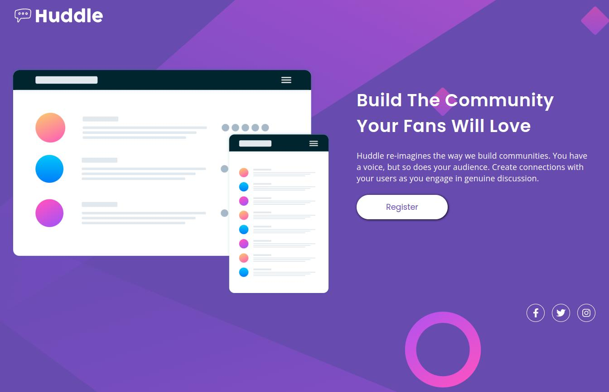
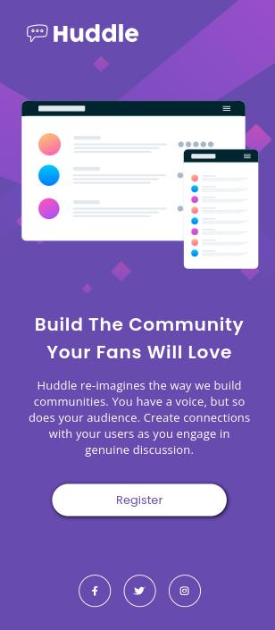

# Quest html e css avançado Huddle

Projeto aplicado no curso DevQuest, baseado no desafio do Frontend Mentor Huddle landing page.

## Versão Desktop:

## Versão Mobile: 

## Desafios do Projeto:
- Criar uma página HTML semântica.
- Posicionar os elementos através do CSS.
- Tornar a página responsiva através do CSS.

## Linguagens Utilizadas:

- HTML
- CSS